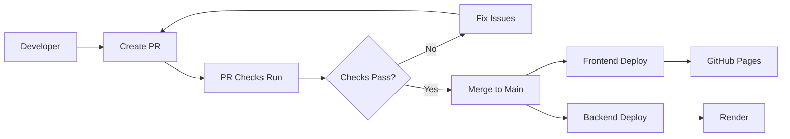

# GitHub Actions CI/CD Workflows

This directory contains the automated CI/CD workflows for the Pixel Portfolio project.

## 📋 Workflows Overview

### 1. Frontend Deployment (`frontend-deploy.yml`)

**Purpose**: Automatically deploy the React frontend to GitHub Pages

**Triggers**:
- Push to `main` branch (when frontend files change)
- Manual dispatch via GitHub UI

**Steps**:
1. **Lint and Test**: Runs ESLint, tests, and generates coverage
2. **Build**: Creates production build with Vite
3. **Deploy**: Uploads to GitHub Pages

**Environment Variables**:
- `VITE_API_URL`: Backend API URL (from secrets)
- `VITE_GA_TRACKING_ID`: Google Analytics ID (optional)
- `VITE_ENABLE_KONAMI_CODE`: Enable Konami code easter egg
- `VITE_ENABLE_LOADING_SCREEN`: Enable loading screen

**Required Secrets**:
- `BACKEND_API_URL`
- `GA_TRACKING_ID` (optional)

---

### 2. Backend Deployment (`backend-deploy.yml`)

**Purpose**: Test and deploy FastAPI backend to Render

**Triggers**:
- Push to `main` branch (when backend files change)
- Manual dispatch via GitHub UI

**Steps**:
1. **Test Job**:
   - Run flake8 linter
   - Run mypy type checker
   - Run bandit security scanner
   - Run safety dependency checker
   - Run pytest with coverage

2. **Deploy Job** (only on main branch):
   - Trigger Render deployment via webhook
   - Wait for deployment to complete
   - Run health check
   - Report deployment status

**Required Secrets**:
- `RENDER_DEPLOY_HOOK_URL`
- `BACKEND_API_URL`

**Test Environment Variables**:
- `SECRET_KEY`: Test secret key
- `N8N_WEBHOOK_URL`: Mock webhook URL
- `ENVIRONMENT`: test

---

### 3. PR Checks (`pr-checks.yml`)

**Purpose**: Ensure code quality on pull requests

**Triggers**:
- Pull request to `main` or `develop` branches

**Checks**:

**Frontend**:
- Code formatting check (Prettier)
- ESLint linting
- Unit tests
- Build verification

**Backend**:
- Code formatting check (Black)
- Flake8 linting
- Unit tests

**No deployment** occurs for PRs - only quality checks

---

## 🔧 Setup Instructions

### 1. Enable GitHub Pages

1. Go to **Settings** → **Pages**
2. Source: **GitHub Actions**
3. Save

### 2. Configure GitHub Secrets

See [SECRETS.md](./SECRETS.md) for detailed instructions on setting up secrets.

**Quick Setup**:
```bash
# GitHub Repository Settings → Secrets and Variables → Actions

# Add these secrets:
BACKEND_API_URL=https://your-backend.onrender.com
RENDER_DEPLOY_HOOK_URL=https://api.render.com/deploy/srv-xxxxx?key=xxxxx
GA_TRACKING_ID=UA-XXXXXXXXX-X  # Optional
```

### 3. Set up Render

1. Create new Web Service on Render
2. Connect GitHub repository
3. Configure environment variables (see SECRETS.md)
4. Get Deploy Hook URL from Settings
5. Add Deploy Hook to GitHub Secrets

### 4. Verify Setup

Test the workflows manually:

1. Go to **Actions** tab
2. Select a workflow
3. Click **Run workflow**
4. Select `main` branch
5. Click **Run workflow**

Monitor the logs to ensure everything works correctly.

---

## 🚀 Deployment Flow

### Normal Development Flow



### Manual Deployment

1. Go to **Actions** tab
2. Select workflow to run
3. Click **Run workflow**
4. Choose branch (usually `main`)
5. Click **Run workflow** button

---

## 📊 Workflow Status

Check workflow status:
- **Actions tab**: See all workflow runs
- **README badge**: Add status badges to your README
- **Email notifications**: Configure in GitHub settings

### Adding Status Badges

Add these to your main README.md:

```markdown
[](https://github.com/yourusername/portfolio/actions/workflows/frontend-deploy.yml)

[](https://github.com/yourusername/portfolio/actions/workflows/backend-deploy.yml)

[](https://github.com/yourusername/portfolio/actions/workflows/pr-checks.yml)
```

---

## 🐛 Troubleshooting

### Frontend deployment fails

**Issue**: Build fails with "Cannot find module"
**Solution**:
- Check `package.json` dependencies
- Run `npm ci` locally to verify
- Check Node.js version (should be 18)

**Issue**: Environment variable not found
**Solution**:
- Verify secret name matches exactly (case-sensitive)
- Check secret is set at repository level
- Secrets should not have quotes in the value

### Backend deployment fails

**Issue**: Render deployment not triggered
**Solution**:
- Verify `RENDER_DEPLOY_HOOK_URL` is correct
- Check Render service is active (not paused)
- Try triggering deploy hook manually with curl

**Issue**: Health check fails
**Solution**:
- Wait longer for deployment (increase sleep time)
- Check Render logs for errors
- Verify environment variables are set in Render

### PR checks fail

**Issue**: Linting errors
**Solution**:
- Run `npm run lint` or `flake8` locally
- Fix reported issues
- Commit and push fixes

**Issue**: Tests fail
**Solution**:
- Run tests locally: `npm test` or `pytest`
- Fix failing tests
- Ensure all dependencies are installed

---

## 🔒 Security

### Best Practices

1. **Never commit secrets** - Use GitHub Secrets only
2. **Rotate secrets regularly** - Every 3-6 months
3. **Limit secret access** - Only necessary team members
4. **Review workflow logs** - Check for exposed secrets
5. **Use `continue-on-error: true`** - For optional steps only

### Secrets in Logs

GitHub automatically masks secrets in logs, but be careful with:
- Echo commands that might expose secrets
- Error messages that include environment variables
- Debug logs in production

---

## 📈 Performance

### Optimization Tips

1. **Cache dependencies**:
   - ✅ Already using `cache: 'npm'` for Node.js
   - ✅ Already using `cache: 'pip'` for Python

2. **Parallel jobs**:
   - ✅ Frontend lint+test runs before build
   - ✅ Backend test runs before deploy
   - ✅ PR checks run frontend and backend in parallel

3. **Conditional execution**:
   - ✅ Backend deploy only on main branch
   - ✅ Workflows only run when relevant files change

### Typical Execution Times

- **PR Checks**: 3-5 minutes
- **Frontend Deploy**: 4-6 minutes
- **Backend Deploy**: 5-7 minutes (including health check wait)

---

## 🔄 Maintenance

### Regular Tasks

- **Weekly**: Review failed workflow runs
- **Monthly**: Check for workflow updates (Actions versions)
- **Quarterly**: Rotate secrets
- **Yearly**: Review and optimize workflows

### Updating Workflows

1. Create feature branch
2. Modify workflow files
3. Test with `workflow_dispatch` trigger
4. Create PR
5. Verify PR checks pass
6. Merge to main

---

## 📚 Resources

- [GitHub Actions Documentation](https://docs.github.com/en/actions)
- [GitHub Pages Deployment](https://github.com/actions/deploy-pages)
- [Render Deployment](https://render.com/docs/deploys)
- [FastAPI CI/CD Best Practices](https://fastapi.tiangolo.com/deployment/docker/)

---

**Last Updated**: February 7, 2026
**Maintained By**: Portfolio Development Team
